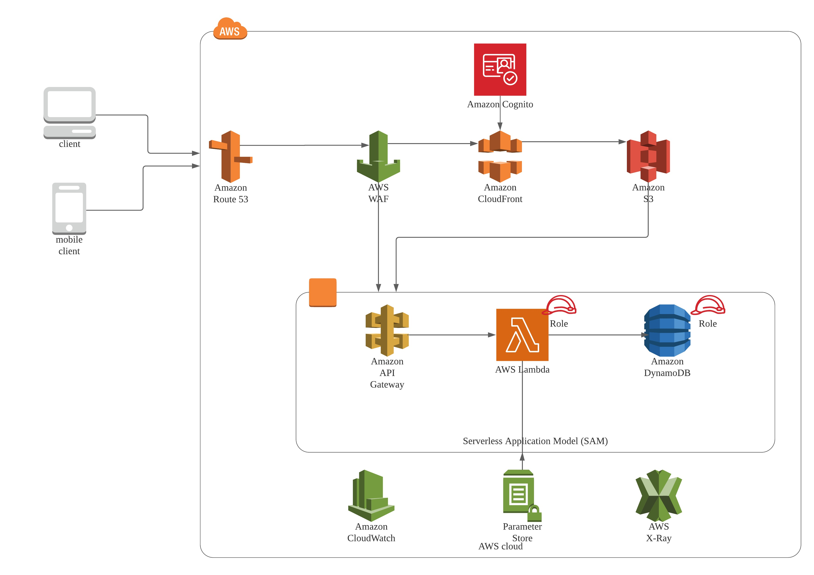
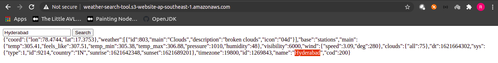
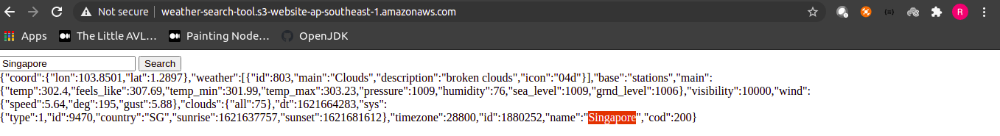
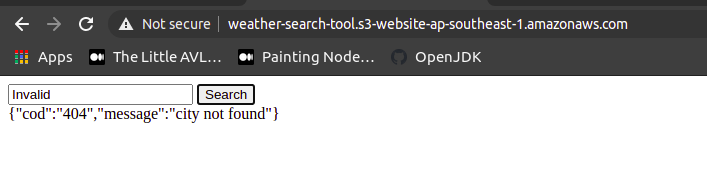
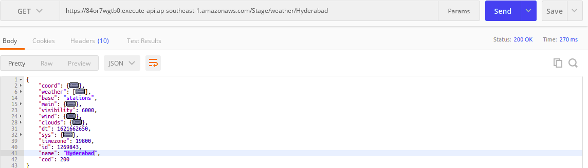
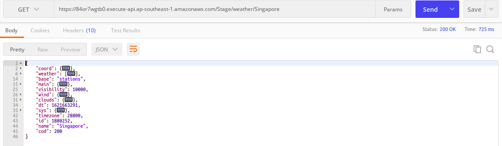
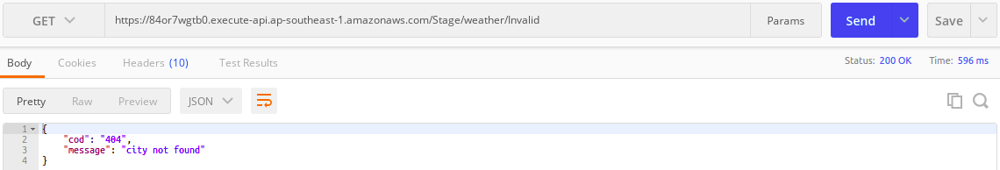
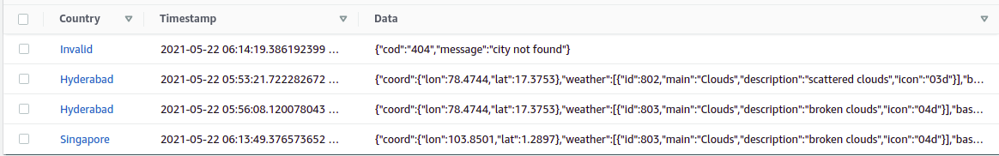
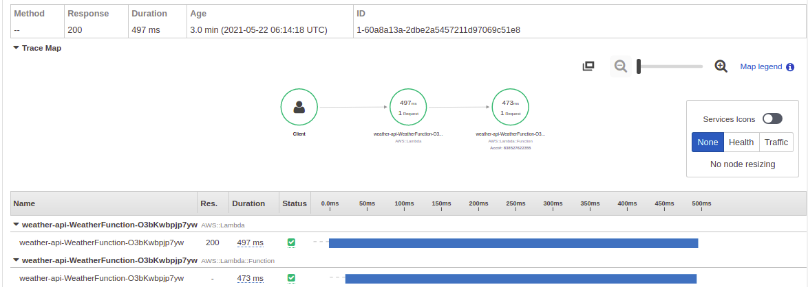

# weather-reporting-tool

This is a AWS Based serverless solution for the multi-tier web application.

## Architectural diagram



## Folder Structure

```bash
.
├── index.html                <-- Static Html page to search country based weather
├── Makefile                  <-- Make to automate build and deployments
├── multi-tier-web-app.jpeg   <-- Architectural diagram of this project
├── README.md                 <-- Instructions file
├── samconfig.toml            <-- SAM tool configs
├── setup.sh                  <-- Set of commands to have secret key and s3 static website
├── template.yaml             <-- SAM Template
└── weather-api
    ├── api.go                <-- Apigate way Lambda Handler
    ├── go.mod                <-- Go module file
    ├── go.sum
    ├── repository            <-- Repository Package
    │   ├── dynamo_db.go      <-- AWS DynamoDB Interface
    │   ├── dynamo_db_test.go <-- Test cases of DynamoDB Interface
    │   ├── weather_client.go <-- External Weather API Client Interface
    │   └── weather_client_test.go  <-- Test cases of Weather API Client Interface
    ├── utils
    │   ├── secret_manager.go  <-- AWS Secret Parameter store Interface
    │   └── secret_manager_test.go <-- Test cases of Secret Parameter store Interface
    └── weather-api
```

## Requirements

* Golang
* Docker
* AWS CLI
* SAM CLI
* AWS Account
* VS Code/Goland/your favourite Golang IDE

## Packaging and deployment
* `sam package | aws cloudformation package` <- To package our build target
* `sam build` to automatically download all the dependencies and package our build target.
* `sam deploy | aws cloudformation deploy` <- To Deploy into aws cloud

## To Run Local Machine
* `sam local start-api` <- It will start dockerized api in local and access on `127.0.0.1:3000`

### To Run Test cases

```shell
> cd weather-api/
> go test -v ./...
```

### Instructions to Integrate Front end with serverless (Backend) app
* Add Weather Token to Parameter store as SecureString (specified command in setup.sh)
* Once deployed sam to cloud, get api-gateway endpoint from any deployed env and integrate in the index.html and make sure that enable CORS at api-gateway end.


## Screenshots which represents output of this solution

### UI Screenshots





### API (Accessing API-Gateway using Postman) Screenshots





### DynamoDB (DataStore) Items


### Tracing a request using AWS X-Ray

